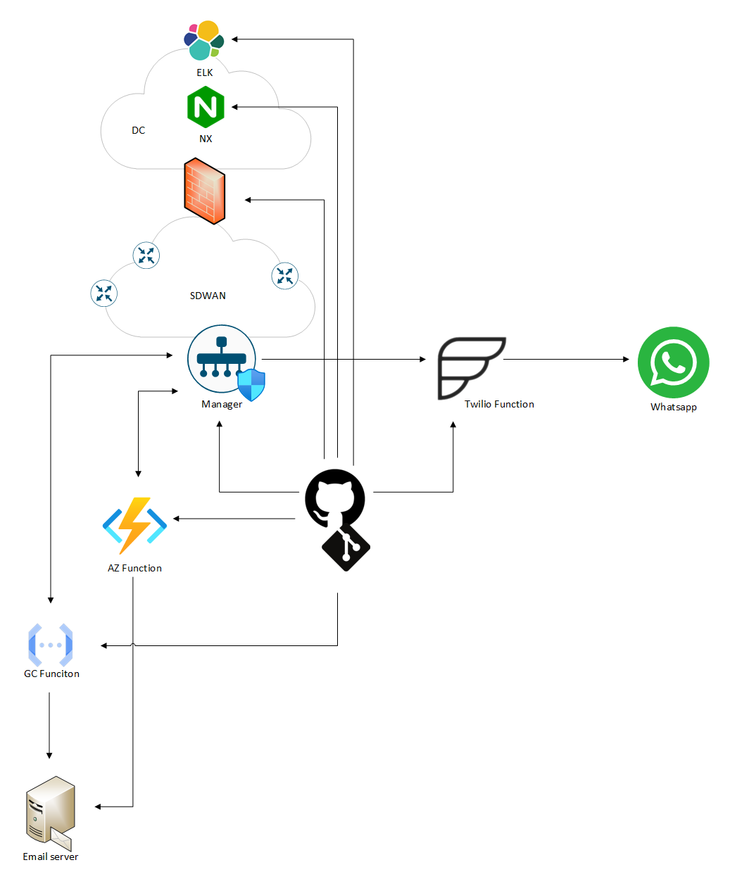

## CV extension

**Repos and some notes**

Since a CV offers limited space to showcase my coding skills, I've included several code sample repositories on GitHub.  

> [!NOTE]
> For most of my projects, the leading branch is the **dev** one. That means that *_dev.yaml file is the most frequently used workflow/pipeline.  

[Infrastructure as Code: SD-WAN and autonomous routers configuration via Terraform](https://github.com/pawel80-dev/IaC-SDWAN-deployment)  
[Infrastructure as Code: SD-WAN bootstrap config generator](https://github.com/pawel80-dev/IaC-SDWAN-config-generator)  
[Infrastructure as Code: SD-WAN – Twilio/Whatsapp alarm notification system](https://github.com/pawel80-dev/IaC-alarms-notifications)  
[Infrastructure as Code: Palo Alto customer policies deployment (Excel, Python, workflow)](https://github.com/pawel80-dev/IaC-PA-customer-rules)  
[Infrastructure as Code: Azure, Google Cloud and on-prem Function deployment via Terraform](https://github.com/pawel80-dev/IaC-Azure-GC-onprem-Function)  
[Infrastructure as Code: Nginx (rev-proxy) and Logstash Ansible role-based configuration (basic)](https://github.com/pawel80-dev/IaC-Nginx-ELK)  

  
*Pipeline centric SD-WAN solution - general design*  